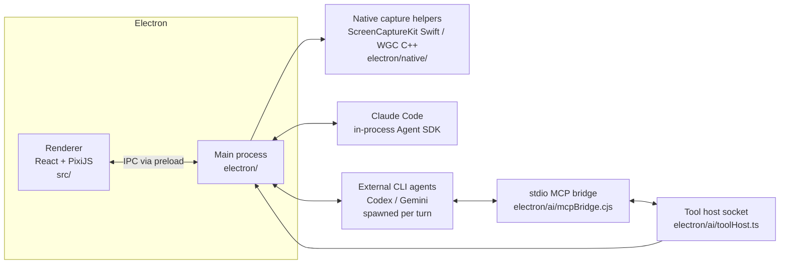

# Vibecut Architecture

A map of the system for contributors — human or LLM. Read this before making
non-trivial changes; it tells you where things live, how data flows, and which
invariants must hold. Working conventions and commands are in
[AGENTS.md](AGENTS.md).

## The three processes (plus guests)

- **Renderer** (`src/`) — all UI and all *editor state*. React components, the
  PixiJS compositing canvas, the timeline, and the export pipeline.
- **Main** (`electron/`) — windows, IPC, recording orchestration, native
  helper processes, and the AI agent runtimes.
- **Native helpers** (`electron/native/`) — Swift (macOS ScreenCaptureKit) and
  C++ (Windows Graphics Capture) binaries for capture and OS-level
  cursor/click tracking. Linux records through the browser pipeline instead.
  Prebuilt binaries land in `electron/native/bin/`.

## Directory map

| Path | What lives there |
|---|---|
| `electron/main.ts` | App entry: windows, single-instance lock, handler registration |
| `electron/ipc/` | IPC surface, one module per feature (`aiChat.ts`, `recordingStream.ts`, `webcamPreview.ts`, `handlers.ts`) |
| `electron/ai/` | Everything AI: providers, tool registry, tool host, MCP bridge, settings |
| `electron/native-bridge/` | Cursor/click telemetry capture and native service supervision |
| `electron/recording/` | Recording container utilities (e.g. webm duration patching) |
| `src/components/launch/` | Pre-recording UI: source picker, webcam/mic toggles |
| `src/components/video-editor/` | Timeline editor: tracks, regions, preview, export panel |
| `src/components/ai-chat/` | AI panel UI + `aiCommandExecutor.ts` (the only editor-mutation gateway for AI) |
| `src/hooks/` | Renderer state hooks (`useAiChat`, `useAiToolHost`, …) |
| `src/lib/` | Pure logic: compositing layout, cursor smoothing, captioning/SRT, exporter, blur, telemetry buffers |
| `src/i18n/locales/<locale>/<namespace>.json` | UI strings, one JSON per namespace per locale |
| `scripts/` | Build helpers (native helper builds, before-pack asset fetching) |
| `site/` | The static landing page (deployed to Vercel, no build step) |

## Core flows

### Recording → project

Launch UI picks a source → main spawns the platform capture helper → video
chunks and **cursor/click telemetry** stream back over IPC → stopping produces
a project (video + telemetry + metadata). The telemetry is what powers
automatic zooms: click moments/positions become zoom keyframes without user
input.

### Editor state and undo (the big invariant)

All editing state lives in the renderer and every mutation goes through the
editor's `pushState` checkpointing. For AI edits the funnel is even narrower:

> AI tool call → `useAiToolHost` → `aiCommandExecutor.ts` (validate/clamp) →
> `pushState` → **exactly one undo step per mutating tool call**

Nothing in the main process ever mutates editor state directly. If you add an
AI capability that changes the video, it must ride this path.

### AI assistant

The right-rail chat panel drives a tool-using agent. Key design decisions:

1. **One tool registry** — `electron/ai/toolDefinitions.ts` holds every tool
   spec (name, description, zod schema) exactly once. From it are derived:
   - the Agent SDK in-process MCP server (Claude path),
   - JSON Schemas served to external CLIs (`listToolJsonSchemas`, zod v4
     `z.toJSONSchema`),
   - the SDK allowlist (`allowedToolNames`).
2. **Tool execution is an RPC into the renderer** — `electron/ai/toolBridge.ts`
   correlates `ai:tool-call` / `ai:tool-result` IPC with timeouts per tool
   (transcription and human-blocking tools get minutes, not seconds).
3. **Providers** (`electron/ai/providers/`) implement one interface
   (`types.ts`: `listModels`, `getStatus`, `createSession`):
   - `claudeCode.ts` — long-lived Agent SDK `query()` with streaming input;
     conversation memory lives in the CLI process; `resume` continues after
     app restarts. Auth: the user's existing Claude login, or a stored
     Anthropic API key injected into the spawned CLI's env. (UI label is
     "Claude" — Anthropic's partner branding guidelines prohibit "Claude
     Code" as a product-facing name.)
   - `codexCli.ts` / `geminiCli.ts` — per-turn CLI spawns built on
     `cliSession.ts` (`PerTurnCliSession`: send queue, lazy temp workspace,
     tool-host lifecycle, cancel/dispose). Codex resumes via
     `codex exec resume <id>` (ChatGPT login); Gemini replays its own
     transcript because it has no headless resume, and authenticates with an
     AI Studio API key injected as `GEMINI_API_KEY` — never the user's Google
     login, which Google's terms prohibit third-party software from using.
   - Session ids handed to the renderer are namespaced (`codex:<id>`) so one
     provider never resumes another's persisted session.
4. **External CLIs get tools via a bridge** — the CLI spawns
   `electron/ai/mcpBridge.cjs` (dependency-free CommonJS, run with
   `ELECTRON_RUN_AS_NODE=1` so users need no Node install) as a stdio MCP
   server; it proxies `tools/list` / `tools/call` over a token-authenticated
   unix socket / named pipe to `toolHost.ts` in main, which executes through
   the same renderer RPC. Tool chips in the chat UI work identically for
   every provider because the host emits the same events.
5. **Sandboxing** — agents get *only* the cinerec tools. Claude: `tools: []`
   plus MCP allowlist. Codex: `--sandbox read-only` in a throwaway workspace.
   Gemini: built-in tools excluded via workspace settings. System prompts are
   delivered as workspace files (`AGENTS.md` for Codex, `GEMINI.md` for
   Gemini) in a temp dir, never through the user's real config.
6. **Settings** — `electron/ai/settings.ts` persists provider/model choice and
   API keys under `userData/ai-settings.json`; keys are encrypted with
   Electron `safeStorage` and never sent to the renderer (only booleans).
7. **Remote policy manifest** — `electron/ai/providerPolicy.ts` fetches
   `provider-policy.json` from the landing deployment (daily, cached in
   userData, fail-open) so a provider whose subscription terms change can be
   flagged (`notice` banner) or shut off (`disabled` gate) in every installed
   app within a day — no release needed. The fetch is a single static-file
   GET; nothing about the user is transmitted. Subscription providers also
   show a one-time informed-consent note in the panel.

### Captions & transcription

On-device Whisper produces timed segments (`get_transcript` caches results).
Captions are `AnnotationRegion`s identical to auto-captions; SRT export lives
in `src/lib/captioning/srt.ts` and is reachable both from the export panel and
the `export_captions_srt` tool.

## i18n

- Locales: every directory under `src/i18n/locales/` (13 today). Namespaces
  are JSON files per locale (`aiChat.json`, `editor.json`, …).
- `useScopedT(namespace)` resolves keys with `{{var}}` interpolation and falls
  back to `en`.
- **Rule: any new user-facing string ships with translations for every
  locale in the same change.** Scripts that patch all locale files at once are
  the norm (see git history for examples).
- The landing page (`site/index.html`) has its own tiny ko/en switcher,
  independent of the app's i18n.

## Build & packaging

- Dev: `vite-plugin-electron` bundles `electron/main.ts` + `preload.ts` into
  `dist-electron/`; the renderer runs on Vite (port 3732 in this repo's
  workflow).
- Packaging: `electron-builder.json5`. Things that must stay outside the asar:
  native `.node` modules, the Agent SDK's vendored `claude` binary
  (`asarUnpack`), and `mcpBridge.cjs` + wallpapers/cursors/caption assets
  (`extraResources`). If you add a file that another *process* must open by
  path, it cannot live inside the asar.
- Native helper builds: `npm run build:native:mac` (Swift, required once per
  clone) / the WGC helper for Windows.

## Testing

- `vitest` (Node 22 required). Tests sit next to their subjects
  (`*.test.ts`) across `src/` and `electron/`.
- Pure logic is deliberately extracted to be testable without Electron:
  e.g. `codexEvents.ts` (CLI stream parsing), `srt.ts`, `compositeLayout.ts`.
  `aiCliBridge.test.ts` round-trips the real tool host + stdio bridge over a
  real socket.

## Provenance

Vibecut is a fork of [OpenScreen](https://github.com/EtienneLescot/openscreen)
(MIT). The recording pipeline, timeline editor, and export engine come from
upstream; the AI assistant layer (`electron/ai/`, `src/components/ai-chat/`),
webcam self-view, SRT pipeline, and branding are Vibecut additions. Generic
fixes should be considered for upstreaming; `upstream` is a configured remote.
