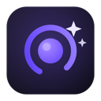

<p align="center">
  
</p>

# <p align="center">Vibecut</p>

<p align="center"><strong>Vibe-edit your screen recordings. Record, then tell the AI what you want — it watches the video, listens to your narration, and edits for you.</strong></p>

<p align="center"><a href="https://vibecut-orcin.vercel.app"><strong>vibecut-orcin.vercel.app</strong></a></p>

<p align="center">
  
  
  
  
</p>

<p align="center">
  <a href="https://github.com/DanialDaeHyunNam/vibecut/releases/latest">
    
  </a>
  &nbsp;
  <a href="https://github.com/DanialDaeHyunNam/vibecut/releases/latest">
    
  </a>
</p>

---

Vibecut is an open-source screen recorder and editor with an **AI editing assistant built in**. Instead of dragging keyframes, you chat:

> "Watch the whole video and edit it professionally — zooms that follow the story, cut the dead air, add subtitles."

The agent **sees** your video (frame sampling), **hears** it (on-device Whisper transcription), asks you clarifying questions with selectable option cards, then applies zooms, cuts, speed-ups, captions, and styling — every change is one undo step.

## ✨ AI editing assistant

- **Bring the AI you already have** — Claude and ChatGPT connect through your existing subscriptions (via the official [Claude Agent SDK](https://code.claude.com/docs/en/agent-sdk/overview) and [Codex CLI](https://github.com/openai/codex)); Gemini uses a free [Google AI Studio API key](https://aistudio.google.com/apikey), per Google's terms for third-party tools. Vibecut only drives the official CLIs — it never extracts or proxies your login tokens. An Anthropic API key also works as an alternative to Claude sign-in.
- **Multimodal context**: project state, click telemetry, video frames, narration transcript.
- **18 editing tools**: zoom / trim / speed / caption CRUD, frame styling (wallpaper, padding, shadows, webcam PIP), SRT export, and `ask_user` interactive questions.
- **One-click flows**: "Understand & brief me" and "Auto-edit this video" (asks your zoom style, target length, and caption language first).
- **Per-project chat memory** that survives restarts — the agent resumes the same session.
- **Provider-policy safety net**: subscription sign-ins are governed by each AI provider's terms, which shifted several times in 2026. Vibecut checks one small static policy file daily (a single JSON GET — nothing about you or your usage is sent) and will warn in-app, or pause a sign-in method, if a provider's policy changes — so a policy shift never silently puts your account at risk.

## 🎥 Recording & editing

Everything from OpenScreen, refined:

- Automatic cinematic zooms from OS-level cursor/click tracking (ScreenCaptureKit on macOS, WGC on Windows)
- Floating webcam self-view while recording — excluded from the capture itself
- Timeline editor: zooms, trims, speed regions, annotations, blur, captions (local Whisper auto-captions)
- Caption export: burn-in toggle + standalone `.srt` (SubRip) sidecar
- Backgrounds, padding, shadows, webcam layouts, MP4/GIF export, 14 languages

## 📦 Download & install

Get the latest build from the [Releases page](https://github.com/DanialDaeHyunNam/vibecut/releases/latest):

| Platform | File |
|---|---|
| macOS (Apple Silicon) | `Vibecut-Mac-arm64-<version>-Installer.dmg` |
| macOS (Intel) | `Vibecut-Mac-x64-<version>-Installer.dmg` |
| Windows 10/11 | `Vibecut.Setup.<version>.exe` |
| Linux | Build from source (AppImage/deb/pacman targets) — see Development below |


### About the "unverified developer" warning

When you first open Vibecut, your OS will warn that the app is from an unverified/unidentified developer. **This message means the app hasn't been code-signed with a paid developer certificate (Apple Developer Program / Windows EV certificate) — it is not a malware detection.** Vibecut is fully open source: you can read every line of what you're running, compare the release to the tagged source, or build it yourself.

To open it anyway:

- **macOS 15 (Sequoia) and later**: open the app once (the warning appears), then go to **System Settings → Privacy & Security**, scroll down, and click **Open Anyway**.
- **Older macOS**: right-click (Control-click) `Vibecut.app` → **Open** → **Open**.
- **Windows**: when SmartScreen shows "Windows protected your PC", click **More info** → **Run anyway**.

Only download Vibecut from this repository's Releases page. If you got it anywhere else, don't trust it — build from source instead.

### Getting started

1. **First launch (macOS)**: grant **Screen Recording** and **Accessibility** permissions when prompted (Accessibility powers the click tracking that drives automatic zooms). Camera/microphone are only requested if you turn them on.
2. Pick what to record — a display, window, or area — and optionally enable your webcam (a floating self-view appears; it's not burned into the capture) and microphone. Hit **Record**.
3. **Stop** when done. The editor opens with cinematic zooms already placed from your clicks.
4. Open the **AI** tab in the right rail and tell it what you want: *"Auto-edit this video"*, *"Zoom in when I click the export button"*, *"Add Korean subtitles and save them as SRT"*. It will watch the frames, read your narration, and ask before big changes.
   - Sign-in: your existing **Claude** login (`claude` → `/login` once in any terminal) or an Anthropic API key; **ChatGPT** via `codex login`; **Gemini** via a free [AI Studio API key](https://aistudio.google.com/apikey) pasted under the model picker.
5. Export as MP4 or GIF — captions can be burned in and/or saved as a `.srt` sidecar.

## 🚀 Development

```bash
npm install
npm run build:native:mac   # macOS: Swift capture/cursor helper (Xcode required, ~5s)
npm run dev                # Vite + Electron
npm test                   # vitest (Node 22+)
```

Requirements: Node 22.x, and for the AI assistant one of: a [Claude](https://claude.com) subscription or Anthropic API key, a ChatGPT subscription ([Codex CLI](https://github.com/openai/codex)), or a free [Google AI Studio API key](https://aistudio.google.com/apikey) ([Gemini CLI](https://github.com/google-gemini/gemini-cli) installed).

Contributing — human or AI agent: start with [ARCHITECTURE.md](ARCHITECTURE.md) (system map, data flows, invariants) and [AGENTS.md](AGENTS.md) (commands, conventions, gotchas). The codebase is deliberately structured so LLM agents can navigate it: one tool registry, one mutation gateway, pure logic extracted into testable modules.

## 🙏 Credits & license

Vibecut is built on [OpenScreen](https://github.com/EtienneLescot/openscreen) by [Siddharth Vaddem](https://github.com/siddharthvaddem) and the community continuation by [Etienne Lescot](https://github.com/EtienneLescot) — the recording pipeline, timeline editor, and export engine come from that excellent foundation.

MIT licensed. See [LICENSE](LICENSE) — original OpenScreen copyright preserved.
